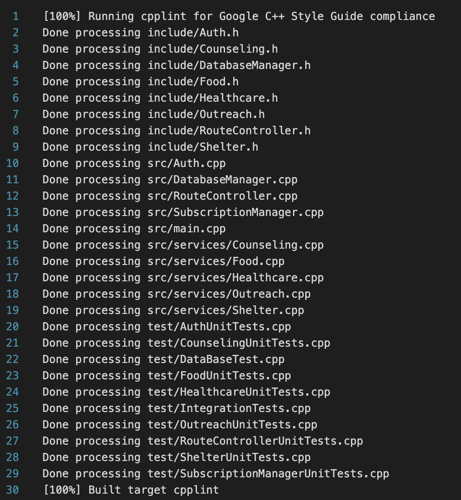

# Git Gud

GitGud is a comprehensive API designed to support various social welfare initiatives, focusing on facilitating access to resources for underserved populations. It serves as a centralized hub for information on diverse initiatives, offering essential services such as shelter, food distribution, healthcare access, outreach programs, and counseling. By connecting individuals and families in need with vital resources, GitGud enhances community support systems and empowers users to navigate their circumstances effectively. Through collaboration with non-profit organizations, volunteers, clinics, and government agencies, GitGud fosters an integrated approach to social welfare that promotes equity and compassion.

**URL:** http://34.138.180.143:8080

**Project management:** https://github.com/users/xxanxnie/projects/7/views/1

# User Types

Our services cater to a diverse range of users, each with unique needs:

- **Homeless (HML)**: Individuals and families without permanent housing.
- **Refugees (RFG)**: Individuals seeking asylum who require immediate shelter and support.
- **Veterans (VET)**: Former military personnel in need of transitional housing and specialized services.
- **Substance Users (SUB)**: Individuals recovering from addiction who require a safe environment and therapeutic support.

**Users allowed to add / update resources:**

- **Non-profit Organizations (NGO)**: Collaborating entities that help distribute resources and support.
- **Volunteers (VOL)**: Community members who assist in various service capacities.
- **Clinics (CLN)**: Healthcare facilities that partner with our services to provide medical support.
- **Government (GOV)**: Local and state agencies that help coordinate resources and services.

# External Libraries Installation

The following libraries need to be installed:

External Libraries:
- **Boost**: A set of C++ libraries designed to enhance the standard C++ library. (https://www.boost.org/)
- **Crow**: A C++ micro web framework. (https://crowcpp.org/master/)
- **Asio**: A cross-platform C++ library for network and low-level I/O programming. (https://think-async.com/Asio/)
- **mongocxx**: The official C++ driver for MongoDB. (https://www.mongodb.com/docs/languages/cpp/cpp-driver/current/get-started/download-and-install/)

**These libraries will be automatically installed when you run the `setup.sh` script.**

# Set-up and building the project
From the root directory:

``` bash
./setup.sh
```

# Running the app
From the root directory:

``` bash
cd build
./GitGud
```

# Running the tests
From the root directory:

``` bash
cd build
./GitGudTests
```

# Authentication
The current implementation uses a basic authentication mechanism with hardcoded API keys to control access to various endpoints based on user roles. Requests are authenticated by validating the API key against predefined roles, such as NGOs, clinics, and volunteers. In future iterations, this system will be enhanced to include dynamic API key generation, role-based access control, and improved security features.

# Endpoints

**Outreach**
  1. Add Outreach Service
  - **Expected Input (JSON):**
  ```json
  {
    "Name":"Emergency Shelter Access",
    "City":"New York",
    "Address":"200 Varick St, New York, NY 10014",
    "Description":"Provide information and assistance for accessing shelters.",
    "ContactInfo":"Sarah Johnson, sarah@email.com",
    "HoursOfOperation":"05/01/24 - 12/31/24",
    "TargetAudience":"HML"
  }
  ```
  - **Endpoint:** `POST /resources/outreach/add`
  - **Description:** This endpoint allows clients to add a new outreach service to the system. It expects a POST request containing the necessary details about the outreach service in the request body (e.g., target audience, program name, description, program date, location, and contact informationn). Upon successful addition, the server will respond with a confirmation message.
    * Upon Success: HTTP 201 Status Code is returned new element id in database
    * Upon Failure: An error message is returned
    * Upon Unauthorized: If the request is not coming from an approved client, a 403 Status Code is returned with the message "Unauthorized"

  2. Get All Outreach Services
  - **Endpoint:** `GET /resources/outreach/getAll?start=<integar>`
  - **Description:** This endpoint retrieves at most 50 outreach services available in the system, "start" can control where to start to find. It accepts a GET request and returns a list of outreach services in JSON format. Each service entry includes details such as the target audience, program name, description, program date, location, and contact information.
    * Upon Success: HTTP 200 Status Code is returned string Success
    * Upon Failure: An error message is returned
    * Upon Unauthorized: If the request is not coming from an approved client, a 403 Status Code is returned with the message "Unauthorized"
  3. Update Outreach Service
  - **Expected Input (JSON):**
  ```json
  {
    "id":"673e5b62974f89f4a006c641",
    "Name":"Emergency Shelter Access",
    "City":"New York",
    "Address":"200 Varick St, New York, NY 10014",
    "Description":"Provide information and assistance for accessing shelters.",
    "ContactInfo":"Sarah Johnson, sarah@email.com",
    "HoursOfOperation":"05/01/24 - 12/31/24",
    "TargetAudience":"HML"
  }
  ```
  - **Endpoint:** `UPDATE /resources/outreach/update`
  - **Description:** This endpoint allows clients to update a outreach service in the system. It expects a UPDATE request containing the necessary details about the outreach service in the request body. Upon successful addition, the server will respond with a confirmation message.
    * Upon Success: HTTP 200 Status Code is returned, "Outreach resource update successfully."
    * Upon Failure: An error message is returned
    * Upon Unauthorized: If the request is not coming from an approved client, a 403 Status Code is returned with the message "Unauthorized"
  4. DELETE Outreach Service
  - **Expected Input (JSON):**
  ```json
  {
    "id":"673e5b62974f89f4a006c641"
  }
  ```
  - **Endpoint:** `DELETE /resources/outreach/delete`
  - **Description:** This endpoint allows clients to DELETE a outreach service in the system. It expects a DELETE request containing the necessary details about the outreach service in the request body. Upon successful addition, the server will respond with a confirmation message.
    * Upon Success: HTTP 200 Status Code is returned, "Outreach resource deleted successfully.."
    * Upon Failure: An error message is returned
    * Upon Unauthorized: If the request is not coming from an approved client, a 403 Status Code is returned with the message "Unauthorized"
**Shelter**
  1. Add Shelter Service
  - **Expected Input (JSON):**
  ```json
  {
    "Name" : "Columbus",
    "City" : "New York",
    "Address": "temp",
    "Description" : "NULL",
    "ContactInfo" : "66664566565",
    "HoursOfOperation": "2024-01-11",
    "ORG":"NGO",
    "TargetUser" :"HML",
    "Capacity" : "100",
    "CurrentUse": "10"
  }
  ```
  - **Endpoint:** `POST /resources/shelter/add`
  - **Description:** This endpoint allows clients to add a new shelter service to the system. It expects a POST request containing the necessary details about the shelter service in the request body. Upon successful addition, the server will respond with a confirmation message.
  * Upon Success: HTTP 201 Status Code is returned new element id in database
  * Upon Failure: An error message is returned
  * Upon Unauthorized: If the request is not coming from an approved client, a 403 Status Code is returned with the message "Unauthorized"

  2. Get All Shelter Services
  - **Endpoint:** `GET /resources/shelter/getAll?start<integar>`
  - **Description:** This endpoint retrieves at most 50 shelter services available in the system, "start" can control where to start to find. It accepts a GET request and returns a list of shelter services in JSON format. Each service entry includes details.
    * Upon Success: HTTP 200 Status Code is returned string Success
    * Upon Failure: An error message is returned
    * Upon Unauthorized: If the request is not coming from an approved client, a 403 Status Code is returned with the message "Unauthorized"
  3. Update Shelter Service
  - **Expected Input (JSON):**
  ```json
  {
      "id": "673e7baca135f11947075f02",
      "Name": "dasd",
      "City": "New York",
      "Address": "sadasd",
      "Description": "NULL",
      "ContactInfo": "66664566565",
      "HoursOfOperation": "2024-01-11",
      "ORG": "NGO",
      "TargetUser": "HML",
      "Capacity": "100",
      "CurrentUse": "10"
  }
  ```
  - **Endpoint:** `UPDATE /resources/shelter/update`
  - **Description:** This endpoint allows clients to update a shelter service in the system. It expects a UPDATE request containing the necessary details about the shelter service in the request body. Upon successful addition, the server will respond with a confirmation message.
    * Upon Success: HTTP 200 Status Code is returned, "Shelter resource update successfully."
    * Upon Failure: An error message is returned
    * Upon Unauthorized: If the request is not coming from an approved client, a 403 Status Code is returned with the message "Unauthorized"
  4. DELETE Shelter Service
  - **Expected Input (JSON):**
  ```json
  {
    "id":"673e5b62974f89f4a006c641"
  }
  ```
  - **Endpoint:** `DELETE /resources/shelter/delete`
  - **Description:** This endpoint allows clients to DELETE a shelter service in the system. It expects a DELETE request containing the necessary details about the shelter service in the request body. Upon successful addition, the server will respond with a confirmation message.
    * Upon Success: HTTP 200 Status Code is returned, "Shelter resource deleted successfully.."
    * Upon Failure: An error message is returned
    * Upon Unauthorized: If the request is not coming from an approved client, a 403 Status Code is returned with the message "Unauthorized"
**Healthcare**
  1. Add Healthcare Service
  - **Expected Input (JSON):**
  ```json
  {
  "Name": "My New Hospital",
  "City" : "New York",
  "Address": "456 New St",
  "Description": "General Checkup",
  "HoursOfOperation": "9 AM - 5 PM",
  "eligibilityCriteria": "Adults",
  "ContactInfo": "123-456-7890"
  }
  ```
  - **Endpoint:** `POST /resources/healthcare/add`
  - **Description:** This endpoint allows clients to add a new healthcare service to the system. It expects a POST request containing the necessary details about the healthcare service in the request body (e.g., provider, service type, location, operating hours, eligibility criteria, and contact information). Upon successful addition, the server will respond with a confirmation message.
    * Upon Success: HTTP 201 Status Code is returned new element id in database
    * Upon Failure: An HTTP error status code (e.g., 500) is returned along with an error message detailing the issue.
    * Upon Unauthorized: If the request is not coming from an approved client, a 403 Status Code is returned with the message "Unauthorized"

  2. Get All Healthcare Services
  - **Endpoint:** `GET /resources/healthcare/getAll?start=<integar>`
  - **Description:** This endpoint retrieves at most 50 healthcare services available in the system, "start" can control where to start to find. It accepts a GET request and returns a list of healthcare services in JSON format. Each service entry includes details such as the provider, service type, location, operating hours, eligibility criteria, and contact information.
    * Upon Success: HTTP 200 Status Code is returned with a list of healthcare services in JSON format.
    * Upon Failure: An HTTP error status code (e.g., 500) is returned along with an error message detailing the issue.
    * Upon Unauthorized: If the request is not coming from an approved client, a 403 Status Code is returned with the message "Unauthorized"
  3. Update Healthcare Service
  - **Expected Input (JSON):**
  ```json
  {
      "id": "673d5fbdd5b00329b0067493",
      "Name": "My New Hospital",
      "City": "New York",
      "Address": "456 New St",
      "Description": "General Checkup",
      "HoursOfOperation": "9 AM - 5 PM",
      "eligibilityCriteria": "Adults",
      "ContactInfo": "123-456-7890"
  }
  ```
  - **Endpoint:** `UPDATE /resources/healthcare/update`
  - **Description:** This endpoint allows clients to update a healthcare service in the system. It expects a UPDATE request containing the necessary details about the healthcare service in the request body. Upon successful addition, the server will respond with a confirmation message.
    * Upon Success: HTTP 200 Status Code is returned, "Healthcare resource update successfully."
    * Upon Failure: An error message is returned
    * Upon Unauthorized: If the request is not coming from an approved client, a 403 Status Code is returned with the message "Unauthorized"
  4. DELETE Healthcare Service
  - **Expected Input (JSON):**
  ```json
  {
    "id":"673e5b62974f89f4a006c641"
  }
  ```
  - **Endpoint:** `DELETE /resources/healthcare/delete`
  - **Description:** This endpoint allows clients to DELETE a healthcare service in the system. It expects a DELETE request containing the necessary details about the healthcare service in the request body. Upon successful addition, the server will respond with a confirmation message.
    * Upon Success: HTTP 200 Status Code is returned, "Healthcare resource deleted successfully.."
    * Upon Failure: An error message is returned
    * Upon Unauthorized: If the request is not coming from an approved client, a 403 Status Code is returned with the message "Unauthorized"
**Counseling**
  1. Add Counseling Service
  - **Expected Input (JSON):**
  ```json
  {
    "Name": "New York Psychological Association",
    "City": "New York",
    "Address": "211 E 43rd St, New York, NY 10017",
    "Description": "Provides mental health counseling and therapy services.",
    "ContactInfo": "66664566565",
    "HoursOfOperation": "2024-01-11",
    "counselorName": "Jack"
  }
  ```
  - **Endpoint:** `POST /resources/counseling/add`
  - **Description:** This endpoint allows clients to add a new counseling service to the system. It expects a POST request containing the necessary details about the counseling service in the request body. The required fields are "counselorName" and "specialty".
    * Upon Success: HTTP 201 Status Code is returned new element id in database
    * Upon Failure: HTTP 400 Status Code is returned with an error message
    * Upon Unauthorized: If the request is not coming from an approved client, a 403 Status Code is returned with the message "Unauthorized"

  2. Get All Counseling Services
  - **Endpoint:** `GET /resources/counseling/getAll?start=<integar>`
  - **Description:** This endpoint retrieves at most 50 counseling services available in the system, "start" can control where to start to find. It accepts a GET request and returns a list of counseling services in JSON format. Each service entry includes details about the counselor and their specialty.
  - **Response:**
      * Upon Success: HTTP 200 Status Code is returned with a JSON array of counseling services
      * Upon Failure: An error message is returned
      * Upon Unauthorized: If the request is not coming from an approved client, a 403 Status Code is returned with the message "Unauthorized"
  3. Update Counseling Service
  - **Expected Input (JSON):**
  ```json
  {
    "id" :"673d5056fbc238b2260fd091",
    "Name": "New York Psychological Association",
    "City": "New York",
    "Address": "211 E 43rd St, New York, NY 10017",
    "Description": "Provides mental health counseling and therapy services.",
    "ContactInfo": "66664566565",
    "HoursOfOperation": "2024-01-11",
    "counselorName": "Sam"
  }
  ```
  - **Endpoint:** `UPDATE /resources/counseling/update`
  - **Description:** This endpoint allows clients to update a counseling service in the system. It expects a UPDATE request containing the necessary details about the counseling service in the request body. Upon successful addition, the server will respond with a confirmation message.
    * Upon Success: HTTP 200 Status Code is returned, "Counseling resource update successfully."
    * Upon Failure: An error message is returned
    * Upon Unauthorized: If the request is not coming from an approved client, a 403 Status Code is returned with the message "Unauthorized"
  4. DELETE Counseling Service
  - **Expected Input (JSON):**
  ```json
  {
    "id":"673e5b62974f89f4a006c641"
  }
  ```
  - **Endpoint:** `DELETE /resources/counseling/delete`
  - **Description:** This endpoint allows clients to DELETE a counseling service in the system. It expects a DELETE request containing the necessary details about the counseling service in the request body. Upon successful addition, the server will respond with a confirmation message.
    * Upon Success: HTTP 200 Status Code is returned, "Counseling resource deleted successfully.."
    * Upon Failure: An error message is returned
    * Upon Unauthorized: If the request is not coming from an approved client, a 403 Status Code is returned with the message "Unauthorized"
**Food**
  1. Add Food Resource
  - **Expected Input (JSON):**
  ```json
  {
    "Name" : "OrganicFarm",
    "City" : "New York",
    "Address": "temp",
    "Description" : "Vegetables",
    "ContactInfo" : "66664566565",
    "HoursOfOperation": "2024-01-11",
    "TargetUser" :"HML",
    "Quantity" : "100",
    "ExpirationDate": "10"
  }
  ```
  - **Endpoint:** `POST /resources/food/add`
  - **Description:** This endpoint allows clients to add a new food resource to the system. It expects a POST request containing the necessary details about the food resource in the request body, such as food type, provider, location, quantity, and expiration date.
      * Upon Success: HTTP 201 Status Code is returned new element id in database
      * Upon Failure: An error message is returned
      * Upon Unauthorized: If the request is not coming from an approved client, a 403 Status Code is returned with the message "Unauthorized"

  2. Get All Food Resources
  - **Endpoint:** `GET /resources/food/getAll?start=<integar>`
  - **Description:** This endpoint retrieves at most 50 food resources available in the system, "start" can control where to start to find. It accepts a GET request and returns a list of food resources in a concatenated string format.
      * Upon Success: HTTP 200 Status Code is returned with a concatenated string of all food data
      * Upon Failure: An error message is returned
      * Upon Unauthorized: If the request is not coming from an approved client, a 403 Status Code is returned with the message "Unauthorized"
  3. Update Food Service
  - **Expected Input (JSON):**
  ```json
  {
    "id" :"673d5056fbc238b2260fd091",
    "Name": "New York Psychological Association",
    "City": "New York",
    "Address": "211 E 43rd St, New York, NY 10017",
    "Description": "Provides mental health counseling and therapy services.",
    "ContactInfo": "66664566565",
    "HoursOfOperation": "2024-01-11",
    "counselorName": "Sam"
  }
  ```
  - **Endpoint:** `UPDATE /resources/food/update`
  - **Description:** This endpoint allows clients to update a food service in the system. It expects a UPDATE request containing the necessary details about the food service in the request body. Upon successful addition, the server will respond with a confirmation message.
    * Upon Success: HTTP 200 Status Code is returned, "Food resource update successfully."
    * Upon Failure: An error message is returned
    * Upon Unauthorized: If the request is not coming from an approved client, a 403 Status Code is returned with the message "Unauthorized"
  4. DELETE Food Service
  - **Expected Input (JSON):**
  ```json
  {
    "id":"673e5b62974f89f4a006c641"
  }
  ```
  - **Endpoint:** `DELETE /resources/food/delete`
  - **Description:** This endpoint allows clients to DELETE a food service in the system. It expects a DELETE request containing the necessary details about the food service in the request body. Upon successful addition, the server will respond with a confirmation message.
    * Upon Success: HTTP 200 Status Code is returned, "Food resource deleted successfully.."
    * Upon Failure: An error message is returned
    * Upon Unauthorized: If the request is not coming from an approved client, a 403 Status Code is returned with the message "Unauthorized"

# Branch Coverage

This project uses **GCOV** (coverage tool) and **LCOV** (graphical front-end for GCOV) to generate branch coverage reports for C++ code. After building the project using CMake in the build folder, run `make coverage` which will automatically open the HTML file to view the branch coverage report. If coverage needs to be run again, it may be necessary to clean previous coverage data by using the following commands to delete old `.gcda` and `.gcno` files and rebuild the project:

```bash
find . -name "*.gcda" -delete
find . -name "*.gcno" -delete
```

**Generating coverage report**
*Note*: Running the tests prior to this is required to generate `.gcda` and `.gcno` files which contain information about the execution of the program during test runs - used to measuring code coverage.

From the root directory:

``` bash
cmake --build build --target coverage
```

# Style Checking Analysis

The style checking is done using **cpplint** to ensure compliance with the Google C++.

Run the style checker from root directory using:
```bash
make -C build cpplint > docs/cpplint_output.txt
```

The below shows the style check output for the current state of the project.



# Setup MongoDb Database
1. Install docker
``` bash
# In Linux
sudo snap install docker
```
2. Build the MongoDB locally
The setting is according to [link](https://hub.docker.com/_/mongo/),
``` bash
sudo docker compose up
```
* With this command images( mongo express and mongodb) will pull from dockerhub and build.
* Mongodb IP = http://0.0.0.0:27017, mongo-express=http://0.0.0.0:8081.
* Check more detail in docker-compose.yml file.